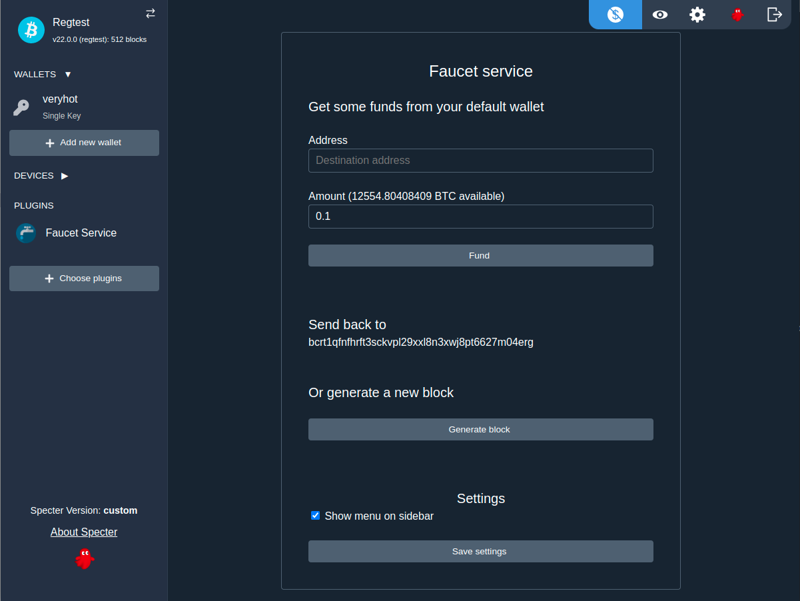

# specterext-faucet

Specter faucet extention for regtest - generate blocks and fund addresses without cli.



Run:

```
python3 -m cryptoadvance.specter server --config DevelopmentConfig --debug
```
